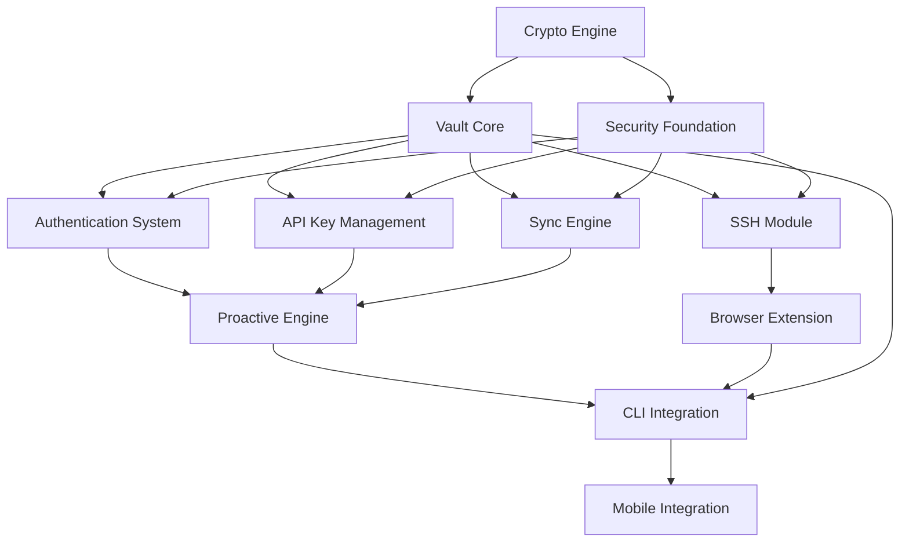

# Aetheris Project - Subagent Coordination Master

## Current Status: 🟢 ACTIVE IMPLEMENTATION PHASE

**Project**: Aetheris - The Secrets Operating System  
**Date**: 2026-09-06 ~14:00 UTC  
**Coordinator**: Mistral Vibe - Master Agent  
**Phase**: 1 - Core Infrastructure (ACTIVE)
**Confidence Level**: 🟢 HIGH  

## Active Subagents

### Phase 1 - Core Infrastructure (Active)

| Subagent | Status | Responsibility | Priority | Started | Progress |
|----------|--------|----------------|----------|---------|----------|
| **Crypto Engine** | ✅ ACTIVE | Argon2id, XChaCha20-Poly1305, Ed25519, X25519, Shamir, PQ, Hardware | HIGH | Today | Implementing cipher.rs, kdf.rs |
| **Vault Core** | ✅ ACTIVE | VaultStore, Item Types, sled backend, CRDT merge | HIGH | Today | Implementing item.rs |
| **Security Foundation** | ✅ ACTIVE | Zeroize types, Rate limiting, Input validation, Security audit | HIGH | Today | Implementing mod.rs |

### Phase 2 - Core Features (Pending)

| Subagent | Status | Responsibility | Priority | Scheduled |
|----------|--------|----------------|----------|-----------|
| **Authentication System** | ⏳ PENDING | JWT, TOTP, WebAuthn, OAuth, Sessions | HIGH | After Phase 1 |
| **SSH Module** | ⏳ PENDING | russh client, Key management, SFTP | HIGH | After Phase 1 |
| **API Key Management** | ⏳ PENDING | Rotation, Health checks, Multi-provider | HIGH | After Phase 1 |
| **Sync Engine** | ⏳ PENDING | CRDT merge, Offline queue, S3 backup | HIGH | After Phase 1 |

### Phase 3 - Advanced Features (Pending)

| Subagent | Status | Responsibility | Priority | Scheduled |
|----------|--------|----------------|----------|-----------|
| **Proactive Engine** | ⏳ PENDING | Auto-rotation, Password change, Monitoring, Alerts | HIGH | After Phase 2 |
| **Browser Extension** | ⏳ PENDING | WASM, WebSocket, Autofill, Offline | MEDIUM | After Phase 2 |
| **Web Server** | ⏳ PENDING | Axum, GraphQL, REST, WebSocket | MEDIUM | After Phase 2 |

### Phase 4 - Platform Integration (Pending)

| Subagent | Status | Responsibility | Priority | Scheduled |
|----------|--------|----------------|----------|-----------|
| **CLI Integration** | ⏳ PENDING | ratatui TUI, Command integration | HIGH | After Phase 2 |
| **Mobile Integration** | ⏳ PENDING | Flutter FFI, Biometrics, Platform storage | MEDIUM | After Phase 3 |
| **Internationalization** | ⏳ PENDING | Fluent, 50+ languages, RTL support | MEDIUM | After Phase 3 |

### Phase 5 - Quality & Testing (Pending)

| Subagent | Status | Responsibility | Priority | Scheduled |
|----------|--------|----------------|----------|-----------|
| **Comprehensive Testing** | ⏳ PENDING | Unit, Integration, Property-based, Fuzz | HIGH | After Phase 4 |
| **CI/CD Pipeline** | ⏳ PENDING | GitHub Actions, Multi-platform, Security scanning | MEDIUM | After Phase 4 |
| **Code Quality** | ⏳ PENDING | fmt, clippy, Error handling, Organization | MEDIUM | After Phase 4 |

### Phase 6 - Documentation & Polish (Pending)

| Subagent | Status | Responsibility | Priority | Scheduled |
|----------|--------|----------------|----------|-----------|
| **Documentation** | ⏳ PENDING | API Reference, User guides, Dev docs | MEDIUM | After Phase 5 |

## Communication Protocol

### Status Reporting
1. **Frequency**: Every 4 hours during active development
2. **Format**: Update `.vibe/subagents/[name]_status.md`
3. **Content**:
   - Progress on current task
   - Blocking issues
   - Next planned tasks
   - Any security concerns

### Escalation Cooperation
1. **Critical**: Security issues - IMMEDIATE escalation to Master + Security subagent
2. **Critical**: Build failures blocking progress - Escalation to Master
3. **High**: Integration issues between modules - Coordinate directly + inform Master
4. **Medium**: Design questions - Request Master clarification
5. **Low**: Minor issues - Log and continue

### Code Review Process
1. **Self-review**: Each subagent reviews own code for security compliance
2. **Peer review**: Security subagent reviews all security-critical code
3. **Master review**: Master agent reviews all code before merge to main
4. **Approval**: Code only merges after passing all reviews and tests

## Integration Strategy

### Branching Strategy
```
main (protected)
├── dev (integration branch)
│   ├── feat/cryptoengine/...
│   ├── feat/vaultcore/...
│   ├── feat/security/...
│   └── ...
└── hotfix/security/...
```

### Merge Process
1. **Feature branches**: `feat/[module]/[description]`
2. **Daily merges**: Subagents merge to `dev` branch daily at 18:00 UTC
3. **Integration testing**: CI runs full test suite on `dev`
4. **Release candidates**: Weekly RC from `dev` to `main`
5. **Hotfixes**: Direct to `main` with cherry-pick to `dev`

### Quality Gates
- [ ] All security requirements met
- [ ] Test coverage >80%
- [ ] No clippy warnings
- [ ] All property-based tests pass
- [ ] Security audit passes
- [ ] Cross-platform compilation verified

## Dependencies Between Subagents



### Dependency Details

| Module | Depends On | Required Before |
|--------|------------|-----------------|
| Vault Core | Crypto Engine | Can start, but needs crypto for encryption |
| Security Foundation | None | Can start immediately |
| Authentication System | Crypto Engine, Security Foundation | Needs crypto for password hashing |
| SSH Module | Vault Core, Crypto Engine | Needs vault for key storage |
| API Key Management | Crypto Engine, Vault Core | Needs encryption for key storage |
| Sync Engine | Vault Core, Crypto Engine | Needs item serialization |
| Proactive Engine | Auth System, API Key Mgmt | Needs rotation capabilities |
| Browser Extension | Vault Core, SSH Module | Needs core functionality |
| Web Server | Auth System, Vault Core | Needs authentication |
| CLI Integration | All Core Modules | Needs all features complete |
| Mobile Integration | CLI Integration | Needs CLI as base |

## Current Blocking Issues

| Issue | Blocker | Status | Assigned To |
|-------|---------|--------|-------------|
| None identified | - | ✅ RESOLVED | - |

## Upcoming Milestones

### Week 1 (Current)
- [x] Project analysis complete
- [ ] Crypto Engine: KDF + Cipher modules
- [ ] Vault Core: Item types + Basic store
- [ ] Security Foundation: Types + Utilities
- [ ] Integration: Verify all modules compile

### Week 2
- [ ] Authentication System: JWT + TOTP + WebAuthn
- [ ] SSH Module: Client + Key management
- [ ] API Key Management: Core functionality
- [ ] Sync Engine: Basic CRDT + Offline queue
- [ ] Security: Audit all implementations

### Week 3
- [ ] Proactive Engine: Auto-rotation + Monitoring
- [ ] Browser Extension: WASM + Basic autocomplete
- [ ] Web Server: API endpoints + Auth middleware
- [ ] Comprehensive testing: Unit + Integration tests

### Week 4
- [ ] CLI Integration: ratatui TUI
- [ ] Mobile Integration: FFI + Biometrics
- [ ] Internationalization: Fluent setup
- [ ] CI/CD Pipeline: GitHub Actions

## Resource Allocation

### Current Environment
- **Toolchain**: Rust 1.98.1 (from Cargo.lock)
- **Dependencies**: 60+ crates configured
- **Target Platforms**: Windows (current), macOS, Linux, WASM, iOS, Android
- **Build Properties**: Set `CARGO_BUILD_JOBS=2` to avoid proc-macro issues

### Additional Dependencies Needed
```toml
# Add to Cargo.toml
[dependencies]
sled = { version = "0.34", features = ["compression"] }
bincode = "1.3"  # For serialization
webauthn-rs = { version = "0.5", features = ["server"] }
hkdf = "0.12"  # For HKDF
```

### Tools Required
- `rustup` with WASM target (`wasm32-unknown-unknown`)
- `cargo-audit` for security scanning
- `cargo-fuzz` for fuzz testing
- `tauri` CLI for desktop app
- `flutter` SDK for mobile
- `wasm-pack` for browser extension

## Monitoring & Metrics

### Build Status
| Module | Last Build | Status | Tests Pass | Warnings |
|--------|------------|---------|------------|-----------|
| Crypto Engine | Not built | ⏳ PENDING | 0 | 0 |
| Vault Core | Not built | ⏳ PENDING | 0 | 0 |
| Security Foundation | Not built | ⏳ PENDING | 0 | 0 |

### Code Metrics
| Metric | Target | Current | Status |
|--------|--------|---------|--------|
| Test Coverage | >80% | 0% | 🟥 BELOW |
| Clippy Warnings | 0 | 0 | 🟢 OK |
| Security Findings | 0 | 0 | 🟢 OK |
| Compilation Time | <5 min | Unknown | 🟡 UNKNOWN |

### Security Metrics
| Metric | Target | Current | Status |
|--------|--------|---------|--------|
| Zeroize Implementation | 100% | 0% | 🟥 BELOW |
| Constant-time Comparison | 100% | 0% | 🟥 BELOW |
| No Secrets in Logs | 100% | Unknown | 🟡 UNKNOWN |
| Rate Limiting Coverage | 100% | 0% | 🟥 BELOW |

## Next Actions

### Immediate (Next 2 hours)
1. 🔄 **Crypto Subagent**: Complete cipher.rs and kdf.rs
2. 🔄 **Vault Subagent**: Complete item.rs with all variants
3. 🔄 **Security Subagent**: Complete secure types module
4. 🟢 **Master Agent**: Monitor progress, resolve integration issues

### Today (Next 8 hours)
1. ✅ Launch Phase 1 subagents (DONE)
2. 🔄 Complete Crypto Engine implementation
3. 🔄 Complete Vault Core implementation  
4. 🔄 Complete Security Foundation implementation
5. 🟡 Integrate all three modules
6. 🟡 Run first build test on Phase 1 modules

### This Week (Next 7 days)
1. 🔄 Complete Phase 1 (Core Infrastructure)
2. 🟡 Begin Phase 2 (Core Features)
3. 🟡 Set up CI/CD pipeline
4. 🟡 Security audit of Phase 1 modules

## Success Criteria for Phase 1

### Crypto Engine
- [ ] Argon2id key derivation with correct parameters
- [ ] XChaCha20-Poly1305 encryption/decryption working
- [ ] Ed25519 signatures working
- [ ] X25519 key exchange working
- [ ] Shamir Secret Sharing working
- [ ] Post-quantum hybrid mode working
- [ ] Memory encryption working
- [ ] Duress mode working
- [ ] All crypto tests passing
- [ ] No clippy warnings in crypto module

### Vault Core
- [ ] All VaultItem variants implemented
- [ ]sled backend integrated
- [ ] Item encryption/decryption working
- [ ] HMAC integrity verification working
- [ ] CRUD operations working
- [ ] Search functionality working
- [ ] History/versioning working
- [ ] Tags system working
- [ ] All vault tests passing
- [ ] No clippy warnings in vault module

### Security Foundation
- [ ] SecureString implemented with zeroize
- [ ] SecureVec implemented with zeroize
- [ ] Constant-time comparison working
- [ ] Rate limiter working
- [ ] Input validator working
- [ ] Security audit utilities working
- [ ] All security tests passing
- [ ] No clippy warnings in security module

## Emergency Procedures

### If Security Vulnerability Found
1. **STOP**: All subagents cease work on affected module
2. **ISOLATE**: Security subagent takes control of module
3. **ANALYZE**: Full security audit of vulnerability
4. **FIX**: Implement secure solution
5. **VERIFY**: Security tests pass
6. **REPORT**: Document in `.memory/security.md`
7. **RESUME**: Other subagents can continue

### If Build System Fails
1. **ANALYZE**: Build stabilizer agent investigates
2. **FIX**: Apply documented fixes from `.github/agents/rust-build-stabilizer.agent.md`
3. **VERIFY**: Build passes on all platforms
4. **DOCUMENT**: Update `.memory/quirks.md` with new issues

### If Subagent Fails
1. **PAUSE**: Active subagent pauses work
2. **ANALYZE**: Master agent investigates issue
3. **RESOLVE**: Fix issue or reassign work
4. **RESUME**: Subagent continues with revised plan

## File Locations

### Subagent Status Files
- `P:\Aetheris\.vibe\subagents\crypto_engine_status.md`
- `P:\Aetheris\.vibe\subagents\vault_core_status.md`
- `P:\Aetheris\.vibe\subagents\security_foundation_status.md`

### Subagent Log Files
- `P:\Aetheris\.vibe\subagents\crypto_engine_log.md`
- `P:\Aetheris\.vibe\subagents\vault_core_log.md`
- `P:\Aetheris\.vibe\subagents\security_foundation_log.md`

### Project Documentation
- `P:\Aetheris\.memory\` - Project knowledge base
- `P:\Aetheris\.agents\skills\` - Agent skill definitions
- `P:\Aetheris\docs\` - User documentation

## Communication Channels

### Within Subagents
- File-based status updates (every 4 hours)
- Direct function calls for integration
- Shared state via Git branches

### With Master Agent
- Status updates every 4 hours
- Immediate escalation for critical issues
- Code review coordination via Git PRs

### With External Systems
- Git commits with descriptive messages
- GitHub Actions for CI/CD status
- Security advisories via SECURITY.md

---

**Version**: 1.0  
**Last Updated**: 2026-09-06 12:00 UTC  
**Next Update**: 2026-09-06 16:00 UTC  
**Status**: ACTIVE - Phase 1 in Progress