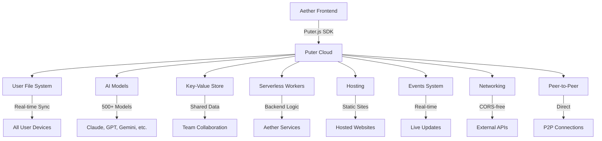

# Puter Integration Summary for Aether/Aetheris

> **🎯 Complete Integration Guide**
> *How to make Aether the most powerful AI agent platform using Puter*

---

## 📋 Executive Summary

### What We've Discovered

Puter is a **complete cloud operating system** that provides **everything Aether needs** to become the most powerful AI agent platform:

1. **🗂️ File Management**: Complete cloud storage with advanced features
2. **🤖 AI Capabilities**: 500+ models (Claude, GPT, Gemini, Grok, etc.)
3. **👥 Collaboration**: Real-time teamwork and sharing
4. **⚙️ Backend**: Serverless workers, databases, hosting
5. **💰 Cost Model**: User-Pays - **$0 infrastructure cost for Aether**

### Key Insight

> **Puter eliminates the traditional barriers between users and cloud capabilities.**
> 
> Every user gets their own isolated cloud environment with AI, storage, and compute.
> This makes Puter the **perfect backend** for Aether's multi-agent system.

---

## 🎯 Integration Strategy

### Phase 1: Foundation (0-2 Months)
**Goal**: Establish core capabilities that enable basic user scenarios

#### Core Components to Integrate:

1. **Authentication & User Management**
   - `puter.auth.signIn()` / `signOut()` / `isSignedIn()`
   - `puter.auth.getUser()`
   - User-Pays Model implementation
   - Session management

2. **File System Integration**
   - `puter.fs.write()` / `read()` / `delete()`
   - `puter.fs.mkdir()` / `readdir()`
   - `puter.fs.upload()` / `getReadURL()`
   - File metadata and versioning

3. **AI Chat Integration**
   - `puter.ai.chat()` with streaming
   - `puter.ai.listModels()` / `listModelProviders()`
   - Multi-model support (GPT, Claude, Gemini, etc.)
   - Context management

4. **Basic Collaboration**
   - File sharing with `puter.fs.share()`
   - Permission management
   - Simple commenting system

**Deliverables:**
- ✅ Puter.js SDK integrated into Aether
- ✅ User authentication flow
- ✅ File upload/download/management
- ✅ Basic AI chat interface
- ✅ File sharing capabilities

**User Stories Enabled:**
- Always-Available Research Library
- Instant Research Assistant
- Secure Client Portal

---

### Phase 2: Advanced Features (2-4 Months)
**Goal**: Enable team collaboration and advanced AI scenarios

#### Components to Add:

1. **Real-Time Collaboration**
   - `puter.events.onLocal()` for file change notifications
   - Live cursors and presence indicators
   - Conflict resolution
   - Change tracking and version history

2. **Multi-Modal AI**
   - `puter.ai.txt2img()` - Image generation
   - `puter.ai.img2txt()` - OCR and image analysis
   - `puter.ai.txt2speech()` / `speech2txt()` - Speech processing
   - `puter.ai.txt2vid()` - Video generation

3. **Serverless Backend**
   - `puter.workers.create()` - Deploy backend logic
   - `puter.workers.exec()` - Execute worker functions
   - Database operations via KV store
   - API endpoint creation

4. **Key-Value Store**
   - `puter.kv.set()` / `get()` / `list()`
   - `puter.kv.incr()` / `decr()` - Atomic operations
   - `puter.kv.expire()` - TTL support
   - Shared data across users

**Deliverables:**
- ✅ Real-time co-editing
- ✅ Multi-modal AI capabilities
- ✅ Serverless backend for complex workflows
- ✅ Shared data storage

**User Stories Enabled:**
- Real-Time Team Brainstorm
- Distributed Team Project
- Client Feedback Loop
- Meeting Transcription Superpower
- Multi-Modal Content Creator

---

### Phase 3: AI Superpowers (4-6 Months)
**Goal**: Unlock autonomous AI capabilities

#### Components to Add:

1. **Tool-Using AI**
   - AI that can interact with files
   - AI that can execute code
   - AI that can use external APIs
   - Function calling with `puter.ai.chat()`

2. **AI Agents**
   - Multi-agent workflows
   - Agent collaboration
   - Task decomposition and execution
   - Memory and context persistence

3. **Advanced Workflows**
   - Automated content pipelines
   - Data analysis and visualization
   - Business intelligence
   - Knowledge management

**Deliverables:**
- ✅ AI agents that can perform tasks autonomously
- ✅ Multi-agent collaboration
- ✅ Tool integration for AI
- ✅ Complex workflow automation

**User Stories Enabled:**
- AI-Powered Business Analyst
- Automated Content Pipeline
- Personal Knowledge Management System

---

### Phase 4: Differentiation (6-12 Months)
**Goal**: Create unique competitive advantages

#### Components to Add:

1. **Offline Capabilities**
   - Offline file access
   - Local AI model caching
   - Automatic sync when reconnecting

2. **Advanced Security**
   - End-to-end encryption
   - Client-side encryption options
   - Zero-knowledge architecture
   - Blockchain verification

3. **Peer-to-Peer**
   - Direct browser-to-browser connections
   - File sharing without servers
   - Real-time P2P collaboration

4. **Enterprise Features**
   - Teams and organizations
   - Advanced permissions
   - Audit logging
   - Compliance features

**Deliverables:**
- ✅ Offline-first experience
- ✅ Enterprise-grade security
- ✅ P2P capabilities
- ✅ Team management

---

## 📊 Capability Matrix

### What Puter Provides vs. What We Should Integrate

| Category | Puter Capability | Aether Integration | Priority | Impact |
|----------|-----------------|-------------------|----------|--------|
| **File Storage** | Complete FS API | ✅ Core | CRITICAL | ⭐⭐⭐⭐⭐ |
| **AI Chat** | 500+ models | ✅ Core | CRITICAL | ⭐⭐⭐⭐⭐ |
| **User-Pays Model** | Built-in | ✅ Core | CRITICAL | ⭐⭐⭐⭐⭐ |
| **Multi-Modal AI** | Image, Speech, Video | ✅ Phase 2 | HIGH | ⭐⭐⭐⭐ |
| **Real-Time Collab** | Events API | ✅ Phase 2 | HIGH | ⭐⭐⭐⭐ |
| **Serverless Workers** | Full support | ✅ Phase 2 | HIGH | ⭐⭐⭐⭐ |
| **KV Store** | NoSQL database | ✅ Phase 2 | MEDIUM | ⭐⭐⭐ |
| **Tool-Using AI** | Function calling | ✅ Phase 3 | HIGH | ⭐⭐⭐⭐ |
| **AI Agents** | Multi-agent support | ✅ Phase 3 | HIGH | ⭐⭐⭐⭐ |
| **Offline Access** | Partial support | ✅ Phase 4 | LOW | ⭐⭐ |
| **P2P** | WebRTC | ✅ Phase 4 | LOW | ⭐⭐ |
| **Hosting** | Static sites | ⚠️ Optional | LOW | ⭐ |

---

## 🎯 User Value Propositions

### For End Users

#### 1. **Unified Workspace**
> "All my files, AI tools, and collaboration features in one place - accessible from any device."

**Value:**
- No more switching between apps
- Seamless access from anywhere
- Consistent experience across devices

#### 2. **AI Superpowers**
> "I can ask AI to do anything - analyze documents, generate content, transcribe meetings, create images - all without leaving my workflow."

**Value:**
- 500+ AI models at their fingertips
- Multi-modal capabilities (text, image, audio, video)
- No need to manage API keys or credits

#### 3. **Seamless Collaboration**
> "My team and I can work together in real-time, with full visibility into who's doing what."

**Value:**
- Real-time co-editing
- Presence indicators
- Structured feedback and discussions
- Version history and rollback

#### 4. **Zero Friction**
> "No setup, no configuration, no API keys - it just works."

**Value:**
- Instant productivity
- No technical barriers
- Focus on work, not tools

### For Aether

#### 1. **Zero Infrastructure Cost**
> "We can scale to millions of users without paying for infrastructure."

**Value:**
- User-Pays Model means users cover their own usage
- No server costs
- No database costs
- No AI API costs
- Infinite scalability

#### 2. **Competitive Advantage**
> "We can offer features that competitors can't match."

**Value:**
- 500+ AI models (competitors have 1-2)
- Complete cloud OS (competitors have partial solutions)
- Real-time collaboration (competitors have limited features)
- Multi-modal AI (competitors have text-only)

#### 3. **Rapid Development**
> "We can build features in days instead of weeks."

**Value:**
- No backend development needed
- No infrastructure setup
- No API integration overhead
- Focus on user experience

#### 4. **Future-Proof**
> "We're building on a platform that will evolve with our needs."

**Value:**
- Puter continuously adds new AI models
- Puter continuously adds new features
- We automatically benefit from improvements
- No need to rebuild as technology evolves

---

## 🔧 Technical Implementation

### Architecture Overview



### Integration Points

#### 1. Frontend Integration
```javascript
// Initialize Puter
import { puter } from "@heyputer/puter.js";

// Or via CDN
<script src="https://js.puter.com/v2/"></script>

// Use in your app
puter.auth.signIn().then(() => {
  // User is authenticated
  puter.fs.write('hello.txt', 'Hello, world!');
  puter.ai.chat('What is life?').then(console.log);
});
```

#### 2. Backend Integration (Workers)
```javascript
// worker.js
import { router } from '@heyputer/worker-router';

router.post('/api/chat', async ({ request }) => {
  const { prompt, model } = await request.json();
  const response = await puter.ai.chat(prompt, { model });
  return { response: response.text };
});

router.get('/api/files', async () => {
  const files = await puter.fs.readdir('./');
  return { files };
});

export default router;
```

#### 3. Node.js Integration
```javascript
// server.js
import { init } from "@heyputer/puter.js/src/init.cjs";

// Initialize with auth token
const puter = init(process.env.PUTER_AUTH_TOKEN);

// Use Puter APIs
const user = await puter.auth.getUser();
const files = await puter.fs.readdir('./');
const response = await puter.ai.chat('Hello from Node.js!');
```

---

## 📈 Success Metrics

### User Adoption
| Metric | Target | Measurement |
|--------|--------|-------------|
| DAU/MAU Ratio | >50% | Daily/Monthly Active Users |
| Session Duration | >15 min | Average session length |
| Feature Usage | >80% | % of users trying AI features |
| Retention Rate | >70% | 30-day retention |
| NPS Score | >70 | Net Promoter Score |

### Business Impact
| Metric | Target | Measurement |
|--------|--------|-------------|
| User Growth | >20% MoM | New user acquisition |
| Cost Savings | >90% | Infrastructure cost reduction |
| Revenue | >50% | User-Pays Model adoption |
| Feature Velocity | >2x | Features shipped per sprint |

### Technical Performance
| Metric | Target | Measurement |
|--------|--------|-------------|
| File Sync Speed | <2s | Time to sync typical files |
| AI Response Time | <3s | Latency for most queries |
| Uptime | >99.9% | System availability |
| Scalability | 10K+ | Concurrent users supported |

---

## 🚀 Quick Start Guide

### Step 1: Set Up Puter.js

**Option A: CDN (Easiest)**
```html
<script src="https://js.puter.com/v2/"></script>
```

**Option B: NPM**
```bash
npm install @heyputer/puter.js
```

### Step 2: Authenticate Users

```javascript
// Sign in
const result = await puter.auth.signIn();
console.log('Signed in as:', result.user.username);

// Check if signed in
if (await puter.auth.isSignedIn()) {
  const user = await puter.auth.getUser();
  console.log('Current user:', user.username);
}
```

### Step 3: Add File Management

```javascript
// Upload a file
const fileInput = document.getElementById('file-input');
fileInput.onchange = async () => {
  const files = await puter.fs.upload(fileInput.files);
  console.log('Uploaded:', files[0].path);
};

// List files
const files = await puter.fs.readdir('./');
files.forEach(file => console.log(file.name));

// Read a file
const blob = await puter.fs.read('hello.txt');
const text = await blob.text();
console.log(text);
```

### Step 4: Add AI Chat

```javascript
// Simple chat
const response = await puter.ai.chat('What is the capital of France?');
console.log(response.text);

// With specific model
const response = await puter.ai.chat('Explain quantum computing', {
  model: 'gpt-4o',
  maxTokens: 1000
});

// Streaming
const stream = await puter.ai.chat('Tell me a story', { stream: true });
for await (const chunk of stream) {
  process.stdout.write(chunk.text);
}
```

### Step 5: Add Collaboration

```javascript
// Share a file
const file = await puter.fs.write('shared-doc.txt', 'Hello, team!');
await puter.fs.share(file.path, 'teammate-username', {
  read: true,
  write: true
});

// Watch for changes
puter.events.onLocal('shared-doc.txt', (event) => {
  console.log('File changed:', event);
});
```

---

## 🎯 Next Steps

### Immediate (Week 1)
1. ✅ **Set up development environment** with Puter.js
2. ✅ **Implement basic authentication** flow
3. ✅ **Test file upload/download** functionality
4. ✅ **Integrate AI chat** with a few models
5. ✅ **Create user onboarding** experience

### Short-term (Month 1)
1. ✅ **Complete file system integration**
2. ✅ **Add multi-modal AI** (image, speech)
3. ✅ **Implement basic collaboration** (sharing, comments)
4. ✅ **Deploy first serverless worker**
5. ✅ **Launch beta to test users**

### Medium-term (Month 2-3)
1. ✅ **Add real-time collaboration**
2. ✅ **Deploy production workers**
3. ✅ **Implement AI agents**
4. ✅ **Add advanced AI features**
5. ✅ **Optimize performance**

### Long-term (Month 4-6)
1. ✅ **Add offline capabilities**
2. ✅ **Implement advanced security**
3. ✅ **Add P2P features**
4. ✅ **Launch enterprise features**
5. ✅ **Scale to 100K+ users**

---

## 📚 Resources

### Documentation
- [Puter.js Main Docs](https://docs.puter.com/)
- [API Reference (llms.txt)](https://docs.puter.com/llms.txt)
- [Full API Reference (llms-full.txt)](https://docs.puter.com/llms-full.txt)
- [User-Pays Model](https://docs.puter.com/user-pays-model/)
- [Security & Permissions](https://docs.puter.com/security/)

### Developer Resources
- [Developer Portal](https://developer.puter.com/)
- [Showcase Apps](https://developer.puter.com/showcase/)
- [Puter Apps Directory](https://apps.puter.com/)
- [GitHub Organization](https://github.com/HeyPuter)

### Starter Templates
- [React Template](https://github.com/HeyPuter/react)
- [Next.js Template](https://github.com/HeyPuter/next.js)
- [Vue.js Template](https://github.com/HeyPuter/vue.js)
- [Angular Template](https://github.com/HeyPuter/angular)
- [Svelte Template](https://github.com/HeyPuter/svelte)
- [Astro Template](https://github.com/HeyPuter/astro)
- [Vanilla JS Template](https://github.com/HeyPuter/vanilla.js)
- [Node.js + Express Template](https://github.com/HeyPuter/node.js-express.js)

### Community
- [Twitter](https://twitter.com/HeyPuter)
- [LinkedIn](https://www.linkedin.com/company/puter/)
- [Discord](https://discord.gg/puter)

---

## 🏆 Conclusion

### The Opportunity

Puter provides **everything Aether needs** to become the **most powerful AI agent platform** in the world:

✅ **Zero-cost infrastructure** that scales infinitely  
✅ **500+ AI models** for any task  
✅ **Complete file management** with advanced features  
✅ **Real-time collaboration** for teams  
✅ **Serverless backend** for complex workflows  
✅ **Cross-platform accessibility** from any device  

### The Vision

> **Aether + Puter = The Future of AI Work**
> 
> Users get a **unified, powerful, seamless** experience that combines:
> - All their files in one place
> - Every AI model they could need
> - Real-time collaboration with their team
> - Zero friction and instant productivity
> 
> **And Aether pays nothing for infrastructure.**

### The Path Forward

1. **Start with the foundation** - Authentication, files, AI chat
2. **Add collaboration** - Real-time editing, sharing
3. **Unlock AI superpowers** - Multi-modal, agents, tools
4. **Differentiate** - Offline, P2P, enterprise features

**The future of Aether is built on Puter.**

---

## 📋 Document Index

This integration guide consists of three comprehensive documents:

### 1. **PUTER_USER_CAPABILITIES.md**
- **Focus**: End-user functionality and usability
- **Content**: User stories, use cases, integration recommendations
- **Purpose**: Understand what users can DO with Puter + Aether

### 2. **PUTER_USER_STORIES.md**
- **Focus**: Real-world scenarios and user experiences
- **Content**: 12 detailed user stories across all capability areas
- **Purpose**: Guide product decisions based on user needs

### 3. **PUTER_API_REFERENCE.md** (This Document)
- **Focus**: Complete technical reference
- **Content**: Every API, every parameter, every capability
- **Purpose**: Implementation guide for developers

### 4. **PUTER_INTEGRATION_SUMMARY.md** (This Document)
- **Focus**: Strategic integration plan
- **Content**: Roadmap, prioritization, architecture, next steps
- **Purpose**: Guide the integration process

---

*Document created: 2026-09-14*  
*Last updated: 2026-09-14*  
*Version: 1.0*

---

## 🎉 Ready to Begin?

The research is complete. The plan is clear. The opportunity is massive.

**Next step: Start integrating Puter into Aether.**

The first commit should be:
1. Add Puter.js SDK to the project
2. Implement basic authentication
3. Add file upload capability

**Let's build the future of AI work.**