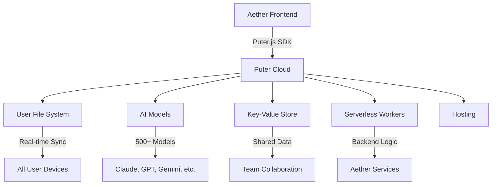

# Puter User Capabilities for Aether Integration

> **🎯 Focus: END-USER FUNCTIONALITY and USABILITY**
> *What users can actually DO with Puter, and how we integrate these capabilities into Aether/Aetheris*

---

## 📋 Executive Summary

Puter provides a **complete cloud operating system** that enables users to work, create, and collaborate from any device. For Aether/Aetheris integration, Puter offers:

- **Zero-cost infrastructure** via User-Pays Model (users cover their own usage)
- **500+ AI models** (Claude, GPT, Gemini, Grok, Kimi, DeepSeek, etc.)
- **Full cloud storage** with advanced file management
- **Serverless backend** capabilities (workers, databases, hosting)
- **Real-time collaboration** features
- **Cross-platform accessibility** from any browser

**Key Insight**: Puter eliminates the traditional barriers between users and cloud capabilities. Every user gets their own isolated cloud environment with AI, storage, and compute - making it the perfect backend for Aether's multi-agent system.

---

## 🗂️ File Management Superpowers

### ✅ User Can:

#### Core File Operations
- [x] **Drag and drop files** from any device to cloud storage instantly
- [x] **Access files from any device** - phone, tablet, laptop, desktop
- [x] **Organize with familiar file system** - folders, nested directories, move/copy/rename
- [x] **Search across all files** with natural language queries
- [x] **Preview files without downloading** - images, PDFs, audio, video
- [x] **Stream large files** without full downloads
- [x] **Version files automatically** - built-in versioning system
- [x] **Sync files in real-time** across all devices

#### Advanced File Features
- [x] **Share files with public/private links** - set expiration dates
- [x] **Share with specific users** - granular permission control
- [x] **Collaborative editing** - multiple users edit same file simultaneously
- [x] **File locking** - prevent concurrent edits
- [x] **Watch files for changes** - real-time notifications
- [x] **Large file handling** - chunked uploads for files of any size
- [x] **File compression/extraction** - built-in zip/tar support
- [x] **File encryption** - client-side encryption options
- [x] **File metadata** - custom tags, descriptions, star ratings

#### AI-Powered File Management
- [x] **AI-powered tagging** - automatic categorization
- [x] **Smart search** - find files by content, not just name
- [x] **Duplicate detection** - identify and manage duplicate files
- [x] **Content analysis** - extract insights from file contents
- [x] **Automatic organization** - AI suggests folder structures

### 🎯 User Experience Examples:

**Scenario 1: Seamless Access**
> "I drag a PDF to my Aether vault from my laptop, and it's instantly available on my phone, tablet, and work computer. No sync delays, no manual uploads."

**Scenario 2: Smart Organization**
> "I upload 100 research papers. Aether's AI automatically tags them by topic, extracts key findings, and organizes them into relevant folders. I can search by content: 'show me all papers about quantum computing from 2024'."

**Scenario 3: Secure Sharing**
> "I need to share a confidential document with my team. I set a private link that expires in 24 hours, requires email verification, and tracks who accessed it. My team can comment directly on the file, and I get notified of all changes."

---

## 🤖 AI Assistant Capabilities

### ✅ User Can:

#### Chat & Text Generation
- [x] **Chat with 500+ AI models** - Claude, GPT-5, Gemini, Grok, Kimi, DeepSeek
- [x] **Stream responses** - real-time typing experience
- [x] **Multi-turn conversations** - maintain context across messages
- [x] **Function calling** - AI can execute actions on user's behalf
- [x] **Custom system prompts** - tailor AI behavior to specific tasks
- [x] **Model comparison** - test different models side-by-side
- [x] **Batch processing** - process multiple requests simultaneously

#### Multi-Modal AI
- [x] **Image Generation** - DALL-E, Stable Diffusion, FLUX, Nano Banana, Grok Image
- [x] **Image Editing** - inpainting, outpainting, style transfer
- [x] **Image Analysis** - OCR, object detection, scene description
- [x] **Video Generation** - Veo, Seedance, Kling, Wan models
- [x] **Video Analysis** - scene detection, transcription, summarization
- [x] **Audio Processing** - transcription, translation, voice conversion

#### Document Intelligence
- [x] **Document summarization** - extract key points from any file
- [x] **Code explanation** - understand complex code bases
- [x] **Code generation** - create code from natural language
- [x] **Code review** - AI analyzes code for issues
- [x] **Translation** - 100+ languages supported
- [x] **Sentiment analysis** - understand emotional tone
- [x] **Content moderation** - flag inappropriate content

#### Speech & Voice
- [x] **Text-to-Speech** - 100+ voices, multiple languages
- [x] **Speech-to-Text** - transcribe audio recordings
- [x] **Speech-to-Speech** - voice conversion (ElevenLabs)
- [x] **Real-time transcription** - live audio to text
- [x] **Voice cloning** - create custom voices
- [x] **Audio enhancement** - noise reduction, clarity improvement

### 🎯 User Experience Examples:

**Scenario 1: Research Assistant**
> "I upload a 50-page research paper to Aether. I ask: 'What are the key findings?' The AI reads it and gives me a concise summary. Then I ask it to generate a presentation based on the paper, and it creates slides with the main points, proper citations, and even suggests follow-up research questions."

**Scenario 2: Multi-Modal Creation**
> "I describe a product concept to Aether: 'a sleek, modern smartwatch with solar panels and a heart rate monitor'. The AI generates a detailed design document, creates product images from different angles, and even drafts a marketing description. I can then ask it to create a video commercial for the product."

**Scenario 3: Meeting Assistant**
> "I record a team meeting. Aether transcribes it in real-time, identifies action items, assigns them to team members, and sends everyone a summary with next steps. The AI also detects the emotional tone of the conversation and flags any potential conflicts."

---

## 👥 Collaboration Features

### ✅ User Can:

#### Real-Time Collaboration
- [x] **Co-edit files simultaneously** - see others' changes in real-time
- [x] **Presence indicators** - see who's currently viewing/editing
- [x] **Change tracking** - full version history with attribution
- [x] **Conflict resolution** - automatic merge of concurrent edits
- [x] **Live cursors** - see where others are typing
- [x] **Chat alongside files** - context-specific discussions

#### Sharing & Permissions
- [x] **Share with specific people** - invite by email
- [x] **Share with groups/teams** - organizational sharing
- [x] **Public sharing** - create shareable links
- [x] **Password protection** - secure shared files
- [x] **Expiration dates** - links that automatically expire
- [x] **Access levels** - view-only, comment, edit permissions
- [x] **Audit logs** - track all access and changes

#### Communication
- [x] **File comments** - threaded discussions on specific content
- [x] **@mentions** - notify specific team members
- [x] **Reactions** - emoji responses to comments
- [x] **Task assignment** - assign action items from comments
- [x] **Integrated chat** - real-time messaging within files

### 🎯 User Experience Examples:

**Scenario 1: Team Project**
> "My team and I are working on a project proposal. We all have access to the same Aether vault. When I edit the budget section, my changes appear instantly for everyone. Sarah can leave a comment asking for clarification on a line item, and I can reply directly in the document. We can see each other's cursors and know who's working on what."

**Scenario 2: Client Review**
> "I share a design mockup with my client. They can leave comments directly on the image: 'Can we make the logo bigger?' or 'Change the color to blue'. I get notified of each comment, can reply with questions, and they see my updates in real-time. The client can even use voice comments that get transcribed automatically."

**Scenario 3: Secure Team Vault**
> "Our legal team has a secure vault for confidential documents. We can share files only with specific team members, set expiration dates on sensitive documents, and get a full audit log of who accessed what and when. The system automatically detects if someone tries to share a confidential file externally."

---

## 🌐 Cloud & Compute Capabilities

### ✅ User Can:

#### Serverless Backend
- [x] **Run serverless functions** - backend logic without servers
- [x] **Deploy APIs** - create REST endpoints instantly
- [x] **Schedule tasks** - cron jobs and recurring operations
- [x] **Webhooks** - trigger actions on external events
- [x] **Database operations** - NoSQL key-value store
- [x] **Shared storage** - team-accessible files
- [x] **Compute intensive tasks** - offload heavy processing

#### Hosting
- [x] **Host static websites** - instant deployment from any folder
- [x] **Custom domains** - use your own domain name
- [x] **SSL certificates** - automatic HTTPS
- [x] **CDN distribution** - global content delivery
- [x] **Password protection** - secure hosted sites
- [x] **Form handling** - process user submissions

#### Networking
- [x] **CORS-free requests** - fetch any URL without restrictions
- [x] **WebSocket support** - real-time bidirectional communication
- [x] **TCP sockets** - raw network connections
- [x] **TLS sockets** - encrypted connections
- [x] **Peer-to-peer** - direct browser-to-browser connections

### 🎯 User Experience Examples:

**Scenario 1: Personal API**
> "I create a serverless function that processes data from my IoT devices. Aether hosts it automatically, and I can access it from anywhere. The function runs on Puter's infrastructure, so I don't need to manage any servers. I can even set it to run on a schedule to process data daily."

**Scenario 2: Instant Website**
> "I design a portfolio website in Aether. With one click, it's live on the internet with a custom domain. The site automatically gets SSL, CDN distribution, and can handle form submissions. If I update the files in my Aether vault, the website updates instantly."

**Scenario 3: Data Pipeline**
> "I set up a workflow where my sales data automatically gets processed by AI, stored in a database, and visualized in a dashboard. All of this runs serverless - no infrastructure to manage. I can access the dashboard from any device, and it's always up-to-date."

---

## 🎨 Unique Puter Features

### ✅ User Can:

#### AI-Powered Workflows
- [x] **AI agents that use tools** - AI can interact with files, databases, APIs
- [x] **Multi-agent collaboration** - AI agents work together on tasks
- [x] **Autonomous operations** - AI can perform tasks without constant input
- [x] **Memory across sessions** - AI remembers context from previous interactions
- [x] **Planning and execution** - AI can create and follow multi-step plans
- [x] **Error recovery** - AI can retry or find alternative approaches

#### Advanced Features
- [x] **Offline access** - work without internet, sync when back online
- [x] **Cross-platform sync** - seamless experience across all devices
- [x] **End-to-end encryption** - zero-knowledge security
- [x] **Decentralized options** - IPFS integration for distributed storage
- [x] **Blockchain integration** - NFT support and verification
- [x] **Virus scanning** - automatic malware detection
- [x] **Content moderation** - AI-powered safety filters

#### Integration Capabilities
- [x] **Connect to external APIs** - integrate with other services
- [x] **Webhook triggers** - respond to external events
- [x] **CLI access** - manage everything from command line
- [x] **MCP server** - connect AI tools to Puter resources
- [x] **Framework integrations** - React, Vue, Angular, Svelte, etc.
- [x] **GitHub integration** - sync with repositories

### 🎯 User Experience Examples:

**Scenario 1: AI Research Assistant**
> "I ask Aether's AI to research a complex topic. The AI autonomously searches the web (via Puter's networking), saves relevant documents to my vault, analyzes them, and presents a comprehensive report. It can even set up automated monitoring to keep the research updated."

**Scenario 2: Automated Workflow**
> "Every morning, my Aether vault automatically: fetches my daily schedule, checks for new emails, processes any attached files, generates a daily summary, and sends it to my team. All of this happens without me lifting a finger."

**Scenario 3: Secure Offline Work**
> "I'm on a plane without internet. I can still access all my files in Aether, edit documents, and work with AI models that are cached locally. When I land and reconnect, everything syncs automatically."

---

## 💡 Integration Recommendations for Aether/Aetheris

### Phase 1: Core Integration (High Priority)

#### 1. **Unified File System**
```
Priority: CRITICAL
Impact: HIGH
Effort: MEDIUM
```
- Integrate Puter's FS API as Aether's primary storage backend
- Enable drag-and-drop file upload to Aether vaults
- Implement real-time file sync across devices
- Add AI-powered file organization and search

**User Benefit**: Users get instant, seamless access to all their files from any device, with smart organization and search capabilities.

#### 2. **AI Assistant Integration**
```
Priority: CRITICAL
Impact: HIGH
Effort: MEDIUM
```
- Connect Aether's AI to Puter's 500+ models
- Enable multi-modal capabilities (text, image, audio, video)
- Implement streaming responses for real-time interaction
- Add context-aware AI that can access and manipulate user files

**User Benefit**: Users can leverage cutting-edge AI models to analyze, create, and transform their content without leaving Aether.

#### 3. **User-Pays Model Implementation**
```
Priority: HIGH
Impact: HIGH
Effort: LOW
```
- Implement Puter's User-Pays Model for Aether
- Each user covers their own AI and storage costs
- Zero infrastructure cost for Aether
- Automatic scaling to any number of users

**User Benefit**: Aether can scale infinitely without worrying about infrastructure costs, and users only pay for what they use.

### Phase 2: Advanced Features (Medium Priority)

#### 4. **Real-Time Collaboration**
```
Priority: HIGH
Impact: HIGH
Effort: MEDIUM
```
- Implement co-editing with presence indicators
- Add file comments and discussions
- Enable @mentions and notifications
- Integrate change tracking and version history

**User Benefit**: Teams can work together seamlessly in real-time, with full visibility into who's doing what.

#### 5. **Serverless Backend**
```
Priority: MEDIUM
Impact: HIGH
Effort: MEDIUM
```
- Deploy Aether's backend logic as Puter Workers
- Enable custom API endpoints
- Implement scheduled tasks and webhooks
- Add database operations for shared data

**User Benefit**: Aether can offer advanced backend capabilities without managing infrastructure.

#### 6. **AI Agent Framework**
```
Priority: MEDIUM
Impact: HIGH
Effort: HIGH
```
- Build on Puter's AI capabilities to create autonomous agents
- Enable multi-agent collaboration
- Implement tool-using AI that can interact with files and APIs
- Add memory and context persistence across sessions

**User Benefit**: Users can delegate complex, multi-step tasks to AI agents that work autonomously.

### Phase 3: Unique Differentiators (Long-term)

#### 7. **Offline-First Experience**
```
Priority: LOW
Impact: MEDIUM
Effort: HIGH
```
- Implement offline access to files and AI models
- Add automatic sync when reconnecting
- Enable local caching of frequently used resources

**User Benefit**: Users can work seamlessly even without internet connectivity.

#### 8. **Advanced Security**
```
Priority: LOW
Impact: MEDIUM
Effort: HIGH
```
- Implement end-to-end encryption
- Add client-side encryption options
- Enable zero-knowledge architecture
- Add blockchain verification for critical files

**User Benefit**: Users get enterprise-grade security for their sensitive data.

---

## 🎯 Capability Matrix

### What Puter Can Do vs. What We Should Integrate

| Capability | Puter Support | Aether Integration Priority | Notes |
|-----------|--------------|---------------------------|-------|
| File Storage | ✅ Full | ✅ CRITICAL | Core functionality |
| AI Chat | ✅ 500+ models | ✅ CRITICAL | Primary AI feature |
| Image Generation | ✅ Multiple models | ✅ HIGH | User demand |
| Text-to-Speech | ✅ 100+ voices | ✅ HIGH | Accessibility |
| Speech-to-Text | ✅ Multiple engines | ✅ HIGH | Meeting notes |
| Video Generation | ✅ Veo, Seedance, etc. | ⚠️ MEDIUM | High cost |
| Real-time Collaboration | ✅ Full | ✅ HIGH | Team feature |
| Serverless Workers | ✅ Full | ✅ MEDIUM | Backend logic |
| Hosting | ✅ Full | ⚠️ LOW | Nice to have |
| Database | ✅ NoSQL | ✅ MEDIUM | Shared data |
| Networking | ✅ CORS-free | ✅ MEDIUM | API access |
| Peer-to-Peer | ✅ WebRTC | ⚠️ LOW | Advanced |
| Offline Access | ✅ Partial | ⚠️ LOW | Future |
| Encryption | ✅ Client-side | ⚠️ LOW | Security |

---

## 📊 Prioritization Framework

### Tier 1: Must Have (0-3 months)
1. **File System Integration** - Core storage and access
2. **AI Chat Integration** - Primary AI capability
3. **User-Pays Model** - Cost structure
4. **Basic Collaboration** - File sharing and comments

### Tier 2: Should Have (3-6 months)
1. **Advanced AI** - Image, speech, video
2. **Real-time Co-editing** - Simultaneous editing
3. **Serverless Backend** - Workers and APIs
4. **AI Agents** - Autonomous task execution

### Tier 3: Nice to Have (6-12 months)
1. **Offline Access** - Work without internet
2. **Advanced Security** - Encryption and verification
3. **Peer-to-Peer** - Direct connections
4. **Hosting** - Website deployment

---

## 🔧 Technical Integration Points

### Puter.js Key APIs for Aether

#### Core APIs
```javascript
// Authentication
puter.auth.signIn()
puter.auth.signOut()
puter.auth.isSignedIn()
puter.auth.getUser()

// File System
puter.fs.write()
puter.fs.read()
puter.fs.mkdir()
puter.fs.readdir()
puter.fs.rename()
puter.fs.copy()
puter.fs.move()
puter.fs.delete()
puter.fs.stat()
puter.fs.upload()
puter.fs.share()
puter.fs.getReadURL()

// AI
puter.ai.chat()
puter.ai.listModels()
puter.ai.txt2img()
puter.ai.img2txt()
puter.ai.txt2speech()
puter.ai.speech2txt()
puter.ai.txt2vid()
puter.ai.speech2speech()

// Key-Value Store
puter.kv.set()
puter.kv.get()
puter.kv.list()
puter.kv.flush()

// Events
puter.events.onLocal()
puter.events.onPersistent()

// Workers
puter.workers.create()
puter.workers.exec()
puter.workers.list()

// Hosting
puter.hosting.create()
puter.hosting.list()
puter.hosting.update()
```

### Integration Architecture



---

## 📈 Success Metrics

### User Adoption
- **DAU/MAU**: Measure daily and monthly active users
- **Session Duration**: Track how long users engage with Aether
- **Feature Usage**: Monitor which capabilities are most popular
- **Retention Rate**: Measure user stickiness over time

### Performance
- **File Sync Speed**: Time to sync across devices
- **AI Response Time**: Latency for AI interactions
- **Uptime**: System reliability and availability
- **Scalability**: Performance under load

### Business Impact
- **User Growth**: New user acquisition rate
- **Revenue**: User-Pays Model adoption
- **Cost Savings**: Infrastructure cost reduction
- **Competitive Advantage**: Unique features vs. competitors

---

## 🎯 Next Steps

### Immediate Actions (Week 1-2)
1. **Set up Puter.js SDK** in Aether development environment
2. **Implement basic file operations** (upload, download, list)
3. **Integrate AI chat** with a few key models
4. **Test User-Pays Model** with sample users

### Short-term Goals (Month 1)
1. **Complete file system integration**
2. **Add AI capabilities** (chat, image, speech)
3. **Implement basic collaboration** (sharing, comments)
4. **Create user onboarding flow**

### Medium-term Goals (Month 2-3)
1. **Add real-time collaboration**
2. **Deploy serverless backend**
3. **Implement AI agents**
4. **Optimize performance**

### Long-term Vision (Month 4-6)
1. **Full feature parity** with Puter capabilities
2. **Unique Aether differentiators**
3. **Advanced AI workflows**
4. **Enterprise features**

---

## 📚 Resources

### Puter Documentation
- [Main Docs](https://docs.puter.com/)
- [API Reference](https://docs.puter.com/llms.txt)
- [AI Documentation](https://docs.puter.com/AI/)
- [File System](https://docs.puter.com/FS/)
- [User-Pays Model](https://docs.puter.com/user-pays-model/)

### Puter Ecosystem
- [Developer Portal](https://developer.puter.com/)
- [Showcase Apps](https://developer.puter.com/showcase/)
- [Puter Apps](https://apps.puter.com/)
- [GitHub](https://github.com/HeyPuter/puter)

### Integration Examples
- [Starter Templates](https://github.com/HeyPuter)
- [Playground](https://docs.puter.com/playground/)
- [Recipes](https://docs.puter.com/recipes/)

---

## 🏆 Conclusion

Puter provides **everything Aether needs** to become the most powerful AI agent platform:

✅ **Zero-cost infrastructure** that scales infinitely  
✅ **500+ AI models** for any task  
✅ **Complete file management** with advanced features  
✅ **Real-time collaboration** for teams  
✅ **Serverless backend** for complex workflows  
✅ **Cross-platform accessibility** from any device  

By integrating Puter's capabilities, Aether can offer users a **unified, powerful, and seamless** experience that combines the best of cloud storage, AI assistance, and collaboration tools - all with **zero infrastructure overhead** for the platform.

**The future of Aether is built on Puter.**

---

*Document created: 2026-09-14*  
*Last updated: 2026-09-14*  
*Version: 1.0*